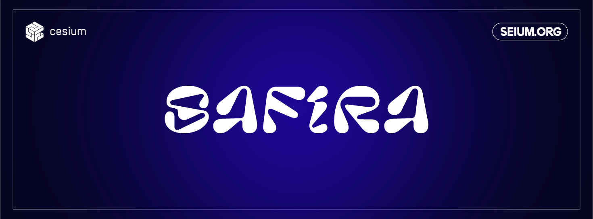

[contributing]: CONTRIBUTING.md
[code_of_conduct]: CODE_OF_CONDUCT.md
[license]: LICENSE
[ci-style-status]: https://github.com/cesium/safira/actions/workflows/style.yml/badge.svg
[ci-style-workflow]: https://github.com/cesium/safira/actions/workflows/style.yml
[figma-design-2022]: https://www.figma.com/file/sPqEvYKlOqL8L7CC2AzxkN/SEI
[figma-badge-2022]: https://img.shields.io/badge/-figma22-s?style=flat&logo=figma&color=black
[figma-design-2021]: https://www.figma.com/file/1phER5eukGFC5p9tFGnfk7/SEI
[figma-badge-2021]: https://img.shields.io/badge/-figma21-s?style=flat&logo=figma&color=black

# 

[![CI Style][ci-style-status]][ci-style-workflow]
[![Design 2022][figma-badge-2022]][figma-design-2022]
[![Design 2021][figma-badge-2021]][figma-design-2021]

## 🤝 Contributing

When contributing to this repository, please first discuss the change you wish
to make via discussions, issue, email, or any other method with the owners of
this repository before making a change.

Please note we have a [Code of Conduct](CODE_OF_CONDUCT.md), please follow it
in all your interactions with the project.

We have a [Contributing Guide][contributing] to help you getting started.

## 📝 License

Copyright (c) 2025, CeSIUM.

This project is licensed under the MIT License - see the [LICENSE][license]
file for details.
